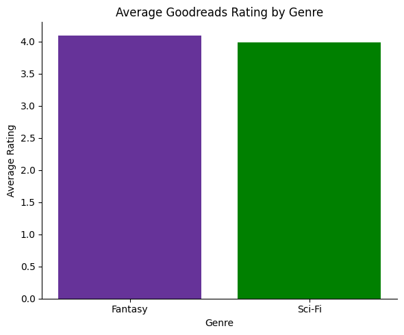
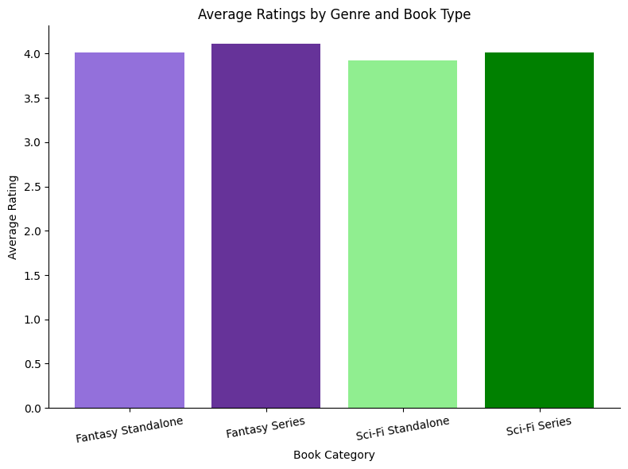

# Sci-Fi & Fantasy Books EDA

## Project Overview

This project explores trends, patterns, and reader preferences in science fiction and fantasy books using exploratory data analysis (EDA).

The goal of this analysis was to investigate questions such as:

- What characteristics are associated with highly rated books?
- Do series books tend to perform better than standalone novels?
- Which genres or subgenres are the most popular?
- Are longer books rated differently than shorter books?
- What relationships exist between popularity, ratings, and publication details?

Using Python, pandas, and data visualization libraries, I cleaned the dataset, explored patterns, and created visualizations to better understand the sci-fi and fantasy book landscape.

---

## Dataset

The dataset contains information about science fiction and fantasy books, including:

- Title
- Author
- Average rating
- Genre/subgenre
- Publication information
- Page count
- Series information
- Popularity metrics

Data source:
https://www.kaggle.com/datasets/michaelcai2021/goodreads-pop-science-fiction-and-fantasy-books

---

## Tools Used

- Python
- pandas
- matplotlib
- seaborn
- Jupyter Notebook

---

## Project Workflow

### 1. Data Cleaning

Before beginning analysis, I cleaned the dataset to improve consistency and reduce issues during visualization and statistical exploration.

Some cleaning steps included:

* Handling missing values
* Removing duplicates
* Standardizing column formats
* Converting data types where needed
* Simplifying categorical values
* Identifying whether books belonged to a series or were standalone novels

I chose these cleaning methods to ensure the analysis focused on meaningful comparisons and to avoid misleading visualizations caused by incomplete or inconsistent data.

---

### 2. Exploratory Data Analysis

During EDA, I explored distributions, correlations, and category trends across the dataset.

Some questions I investigated:

* Are books in a series rated higher on average?
* Which genres receive the strongest reader ratings?
* Does popularity correlate with ratings?
* Are certain publication periods associated with higher-rated books?

I used visualizations throughout the analysis to help identify trends and support conclusions.

---

## Key Visualizations & Findings

### Sci-Fi VS Fantasy Genere Average Ratings



This visualzation compares the average rating of the genere's Sci-fi and Fantasy

I expected them to be the same with no clear victor

The analysis showed:
Fantasy wins the popular vote nearly every time. 

### Series vs Standalone Ratings



This visualization compares average ratings between books that are part of a series and standalone novels.

I expected series books to perform slightly better because readers who enjoy the first installment are more likely to continue reading and rating later books positively.

The analysis showed:
- My findings were alligned with my theory. series books showed higher ratings in general.

---

### Genre Popularity

.png)

This chart explores which sci-fi and fantasy genres appear most frequently in the dataset.

From this visualization, I learned:
- Sci-fi was far and away more popular up to 1990 where is started to compete before taking lead in 2000 and mainly staying fantasy heavy.

---

### Ratings Distribution

.png)

This distribution helped identify how reader ratings cluster across the dataset.

One interesting takeaway was:
- Fantasy is continually higher ranked over time even despite Sci-fi's dominance in the earlier years on my scatter plot.

---

## What I Learned

This project strengthened my understanding of:

- Data cleaning workflows
- Exploratory data analysis techniques
- Building effective visualizations
- Identifying misleading or weak interpretations
- Using storytelling to communicate findings

I also learned how important context and careful preprocessing are when working with real-world datasets.

---

## Future Improvements

If I continue this project, I would like to:

- Add sentiment analysis from book reviews
- Explore author-level trends
- Build recommendation models
- Create interactive dashboards
- Compare sci-fi and fantasy trends separately

---

## How to Run the Project

1. Clone the repository

```bash
git clone https://github.com/Hooperbassman/Sci-Fi_Fantasy_books.git